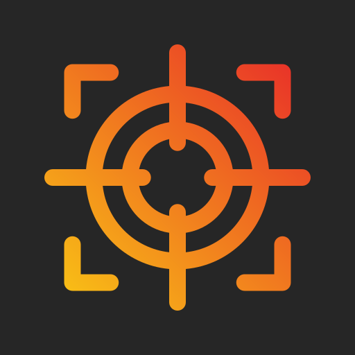
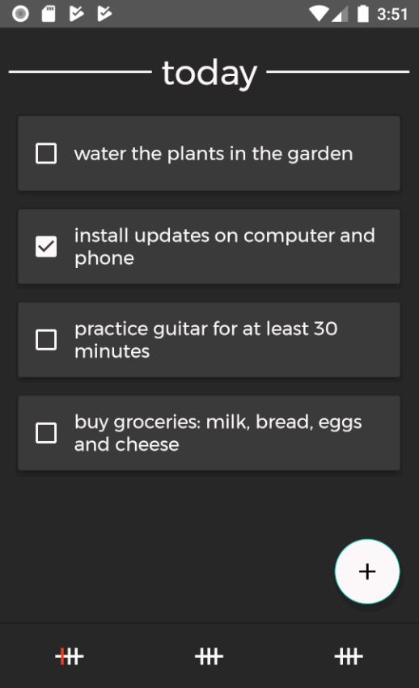
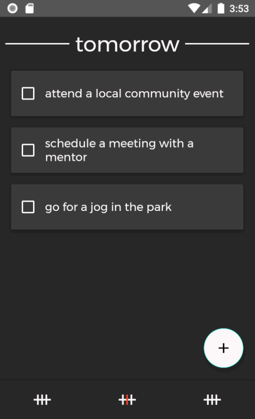
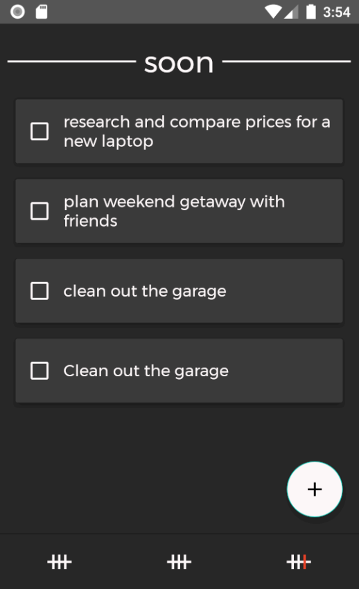

# DirtyWork

 

DirtyWork is a to do list app. It comes with a simple, dark design and supports categorizing your todos into today, tomorrow and soon.

Being able to swipe todos smoothly from right to left is a really handy feature built into it.

Today&nbsp;&nbsp;&nbsp;&nbsp;&nbsp;&nbsp;&nbsp; | Tomorrow |  Soon&nbsp;&nbsp;&nbsp;&nbsp;&nbsp;&nbsp;&nbsp;&nbsp; |
:-------------------------:|:-------------------------:|:-------------------------:|
 |  |  |

## Download & Installation

You can download the APK at the top-level of this repository [dirtywork.apk](https://github.com/lchristmann/android-dirtywork/blob/main/dirtywork.apk).

Install it by clicking on the downloaded file and following the instructions of your phone or go along some tutorial on the internet. It will warn you that APKs from an unknown source are dangerous - and they may be. So if you have doubts either (1) [contact](https://lchristmann.com/contact/) and [get to know me](https://lchristmann.com) or (2) download the whole source code provided here, review it and build the APK yourself with [Android Studio](https://developer.android.com/studio).

## Background story

You can read about how I got to develop this and two more Android applications on my personal website at [lchristmann.com/projects/app-development](https://lchristmann.com/projects/app-development/).